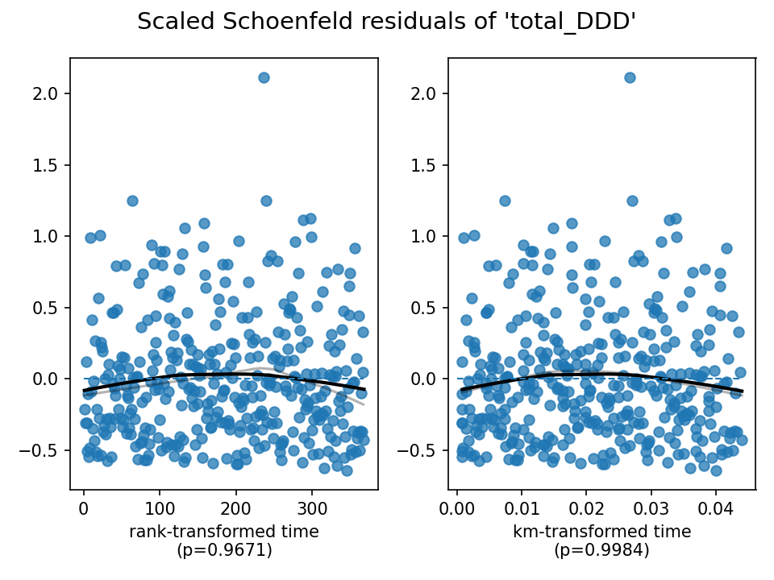

# Survival Analysis of Blood Pressure Treatment Strategies

## Objective
Compare standard (SBP target 140 mmHg) vs. intensive (SBP target 120 mmHg) blood pressure treatment strategies on mortality risk using survival analysis.

**Methods:** Kaplan-Meier estimation, log-rank test, univariate and multivariate Cox proportional hazards regression, proportional hazards assumption diagnostics.

**Tools:** Python (`pandas`, `lifelines`, `matplotlib`)


## 1. Data Overview

Dataset: `BPIntensiveZZ-2.csv` - 9,308 observations, 10 variables.

**Key variables:**
- `Time` → survival duration (in years)
- `Death` → event indicator (1 = death, 0 = censored/alive)
- `Treat` → treatment group (0 = standard, 1 = intensive)
- Covariates: `Age`, `Gender`, `Smoking`, `Triglycerides`, `BMI`, `total_DDD`

**Interpretation:**
- Missingness is minimal - all main survival variables (`Time`, `Death`, `Treat`) are complete.
- 375 death events out of 9,308 (~4% event rate).
- Treatment groups are well balanced (~50% per group; 4,656 vs. 4,652), ensuring comparability.
- Data are well-structured for Cox regression and survival modeling.


## 2. Kaplan-Meier Survival Curves & Log-Rank Test
**Interpretation:**
- The Intensive group maintains a slightly higher survival probability over time compared to the Standard group. The difference is small but consistent.
- The cumulative mortality plot shows the Intensive group with a lower cumulative event rate, confirming reduced mortality risk.
- **Log-rank test:** χ² = 7.2 on 1 df, p = 0.007 - statistically significant difference in survival between the two treatment groups.
- **Conclusion:** Intensive blood pressure treatment significantly improves survival compared to standard treatment.

---

## 3. Univariate Cox Proportional Hazards Regression
**Model output:**
- HR (Treat) = 0.757
- 95% CI = [0.617, 0.929]
- p = 0.0076

**Interpretation:**
- Hazard ratio < 1 ⇒ intensive treatment reduces the risk of death by ~24%.
- Confidence interval does not include 1 ⇒ statistically significant.
- The forest plot shows a single HR < 1, confirming the direction and significance.
- Model-based predicted survival curves mirror the Kaplan-Meier results — the Intensive group shows slightly better survival probabilities.
- **Conclusion:** Univariate analysis supports that intensive BP control lowers mortality risk.

---

## 4. Multivariate Cox Regression Analysis

A multivariate Cox proportional hazards model was fitted to assess how treatment strategy and other clinical factors influence the risk of death. The model included Age, Gender, Treatment type (standard vs. intensive), Smoking status, Triglycerides, BMI, and total_DDD as predictors.

The model was built on 9,170 participants, with 368 deaths observed (138 observations removed due to missing data).

The overall model was statistically significant (Likelihood ratio test = 199.3, p < 2×10⁻¹⁶), indicating that the combination of predictors collectively explained a meaningful amount of variation in survival outcomes. The concordance index (C = 0.69) suggests reasonably good discrimination ability — the model can correctly rank survival times about 69% of the time.

**Interpretation of predictors:**

| Covariate | HR | p-value | Interpretation |
|---|---|---|---|
| Age | 1.08 | < 0.001 | Each one-year increase in age was associated with an 8% higher hazard of death — age is a major prognostic factor |
| Gender | 0.66 | 0.0003 | Females had about 34% lower risk of death compared to males, after adjusting for other factors |
| Treat | 0.75 | 0.0068 | Intensive treatment participants had approximately 25% lower hazard of death than standard treatment — a protective effect |
| Smoking | 2.78 | < 0.001 | Smokers had nearly three times the risk of death compared to non-smokers — consistent with known cardiovascular risks |
| Triglycerides | 1.001 | 0.0117 | Higher triglyceride levels slightly increased mortality risk |
| BMI | — | 0.81 | Not significant — BMI was not independently associated with death risk once other variables were controlled |
| total_DDD | 1.05 | 0.022 | Increased medication exposure was linked with a small rise in mortality risk, possibly reflecting higher disease burden |

**Overall:** Age, gender, treatment strategy, smoking, triglycerides, and total drug exposure significantly influenced survival. The intensive treatment arm appears beneficial, reducing mortality compared to the standard approach. Older age and smoking were the most detrimental factors.

Clinically, these findings reinforce the importance of early intensive management, especially for older and smoking patients, as part of a broader strategy to improve long-term survival outcomes.

---

## 5. Proportional Hazards Assumption Diagnostics



To check whether the proportional hazards assumption held for the Cox regression model, `check_assumptions()` (lifelines' equivalent of R's `cox.zph()`) was used, testing each covariate and producing Schoenfeld-residual-style diagnostic plots.

All covariates had p-values greater than 0.05, and the global test p-value was 0.93, meaning there was no evidence of violation of the proportional hazards assumption. The residual plots for Age, Gender, Treatment, Smoking, Triglycerides, BMI, and total_DDD all showed the smoothed residual lines staying roughly flat around the zero line, with no clear trend over time — visually supporting that the hazards are proportional.

**Summary:** Both the statistical test and the residual plots confirmed that the proportional hazards assumption was satisfied for all variables in the model.

---

## Repository Structure
```
survival-analysis-bp-trial/
├── README.md
├── survival_analysis_bp_trial.ipynb
├── data/
│   └── BPIntensiveZZ-2.csv
└── figures/
    ├── km_curve_full.png
    ├── km_curve_zoom.png
    ├── cumulative_mortality.png
    ├── cox_forest_univariate.png
    ├── cox_predicted_survival.png
    └── ph_diagnostics_all_covariates.png
```

## Key Takeaways
- Intensive blood pressure treatment was associated with a 25% lower mortality hazard (multivariate HR = 0.75, 95% CI 0.61–0.92, p = 0.0068), consistent after adjusting for clinical covariates.
- Log-rank test confirmed a significant survival difference between treatment groups (p = 0.007).
- Proportional hazards assumption held for all covariates (global p = 0.93).
